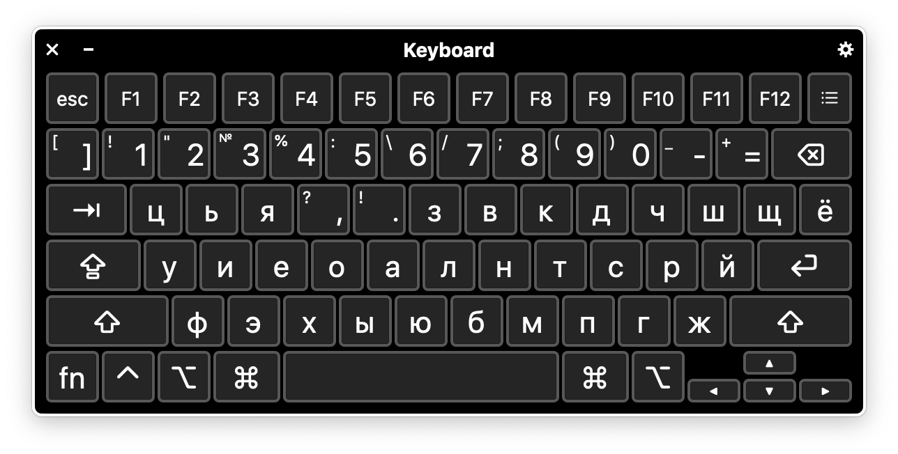
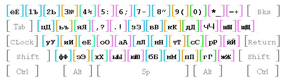
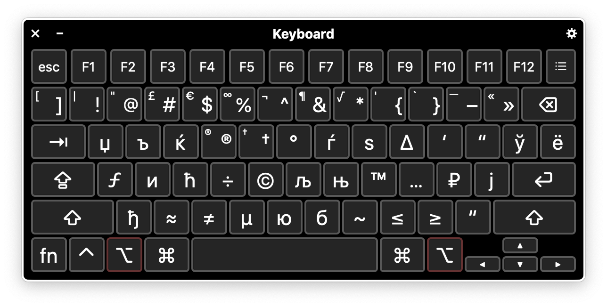
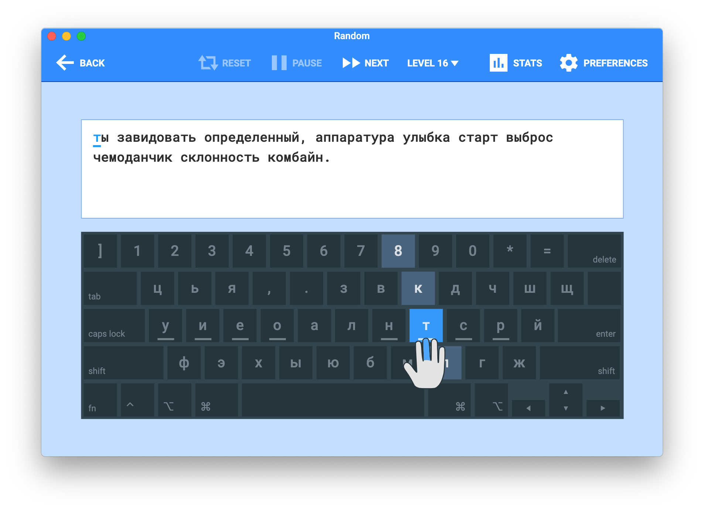

# «Диктор»

«Диктор» — это альтернативная раскладка клавиатуры для русского языка,
позволяющая набирать текст на 15 % эффективнее, чем ЙЦУКЕН.<sup
id="effectiveness">[1](#fn-effectiveness)</sup>

Первоначально раскладка была опубликована на сайте
[geocities.com](http://www.geocities.com/razdel_2006/), однако на данный момент
сайт не работает. Тем не менее, существует
[зеркало](http://olegp.name/software/diktor-keyboard-layout/geocities/) сайта.



## Отличия от оригинальной версии

|Оригинальная версия                                        | Новая версия (с зажатым `Option`)                                      |
|-----------------------------------------------------------|---------------------------------------------------|
|||

- Твёрдый знак вводится нажатием `Option` + `ь`.

- Верхний регистр цифрового ряда максимально соответствует аналогичному на
  оригинальной русской раскладке в macOS. Так как символы `,` и `.` вынесены на
  третий ряд, на их место поставлены символы `\` и `/`.

- Расположение символов, вводимых с зажатым модификатором `Option`, также
  максимально соответствует оригинальному расположению. Некоторые из них были
  передвинуты для большего удобства. Так, например, символ рубля (`₽`) вводится
  нажатием `Option` + `р`.

## QWERTY/Colemak ⌘

Данный пакет содержит 2 раскладки:

- *Диктор — QWERTY ⌘* позволяет использовать комбинации (shortcuts) с
  модификатором `Command` (`⌘`) и клавишами раскладки *QWERTY*, не переключая
  раскладку.

  Например, для поиска текста на странице в веб-браузере достаточно
  нажать `Command` + `о`, так как расположение символа `о` (*CYRILLIC SMALL
  LETTER O*) в раскладке «Диктор» соответствует расположению символа `f` (*LATIN
  SMALL LETTER F*) в *QWERTY*.

- *Диктор — Colemak ⌘* позволяет использовать комбинации (shortcuts) с
  модификатором `Command` (`⌘`) и клавишами раскладки
  [*Colemak*](https://colemak.com/), не переключая раскладку.

  Например, для поиска текста на странице в веб-браузере достаточно нажать
  `Command` + `я`, так как расположение символа `я` (*CYRILLIC SMALL LETTER YA*)
  в раскладке «Диктор» соответствует расположению символа `f` (*LATIN SMALL
  LETTER F*) в *Colemak*.

## Установка

### MacOS

1. Загрузите архив с раскладкой из раздела
   [*Releases*](https://github.com/mshkrebtan/diktor/releases) и распакуйте его.

2. Скопируйте пакет `Diktor.bundle` в директорию:

    - `/Library/Keyboard Layouts`, чтобы установить раскладку для всех
    пользователей системы; или

    - `~/Library/Keyboard Layouts`, чтобы установить раскладку для текущего
    пользователя.

   Для того, чтобы открыть эти директории в Finder, можно использовать функцию
   меню *Переход* > *Переход к папке…* (*Go* > *Go to Folder…*) и вставить
   нужный путь в появившемся окне.

3. Завершите сеанс и заново войдите в систему.

### Linux

1. Добавьте содержимое файла `X11/xkb/symbols/ru` в файл
   `/usr/share/X11/xkb/symbols/ru`:

   ```sh
   sudo cat X11/xkb/symbols/ru >> /usr/share/X11/xkb/symbols/ru
   ```

2. Добавьте следующий блок в файл `/usr/share/X11/xkb/rules/evdev.xml`:

    ```xml
        <variant>
          <configItem>
            <name>diktor</name>
            <description>Russian (Diktor)</description>
          </configItem>
        </variant>
    ```

3. Перезагрузите систему.

### Emacs

    ```elisp
    (load-file ".emacs.d/quail-diktor.el")
    ```

## Тренировка слепой печати

Для тренировки слепой печати можно использовать любую программу-тренажёр с
поддержкой произвольных раскладок и словарей.

### Web

Попрактиковаться онлайн можно здесь:

- [Touch Typing Study](https://www.typingstudy.com/ru-russian_diktor-3/lesson/1)

### Type Fu

Для macOS я рекомендую [Type Fu](https://type-fu.com/). Она позволяет
использовать любую раскладку клавиатуры и тренировать слепую печать на
произвольном наборе слов в режиме *Random*.



Файл с раскладкой «Диктор» для Type Fu можно найти в папке
[type-fu](/type-fu).

### Частотный словарь русской лексики

В качестве словаря русской лексики в Type Fu я использую [Новый частотный
словарь русской лексики Ляшевской и Шарова](http://dict.ruslang.ru/freq.php) на
материалах Национального корпуса русского языка.

Словарь включает наиболее употребительные слова современного русского языка (2-я
половина XX – начало XXI вв.), снабжённые информацией о частотности
употребления, статистическом распределении по текстам и жанрам, по времени
создания текстов. Словарь основан на текстах Национального корпуса русского
языка объёмом 100 млн. словоупотреблений. Подробнее об истории частотных
словарей русского языка и методах создания «Нового частотного словаря русской
лексики» словаря можно прочитать во [Введении](http://dict.ruslang.ru/freq.pdf).

Данный словарь доступен в виде
[CSV-таблицы](http://dict.ruslang.ru/Freq2011.zip). Готовый словарь для Type Fu
можно найти в папке [type-fu](/type-fu).

#### .tfd

Программа Type Fu поддерживает словари в текстовом формате `.tfd`. В начале
файла располагается информация о словаре, после которой идут сами слова, по
одному на каждой строке:

``` tfd
@id custom-2ae1663d-513f-4f66-a40f-1a4bae26ca4f
@type words
@name Russian words
@description Новый частотный словарь русской лексики (http://dict.ruslang.ru/freq.php)
@language ru
@items
и
в
не
на
я
быть
```

С помощью пакета [csvkit](https://csvkit.readthedocs.io/en/latest/index.html)
можно создать словарь из оригинальной CSV-таблицы.

1. Создадим шапку:

   ``` sh
   cat <<EOF > Russian\ words.tfd
   @id custom-2ae1663d-513f-4f66-a40f-1a4bae26ca4f
   @type words
   @name Russian words
   @description Новый частотный словарь русской лексики (http://dict.ruslang.ru/freq.php)
   @language ru
   @items
   EOF
   ```

2. Далее:

    1. `csvgrep` — уберём из таблицы имена собственные, междометия и инициалы;
	2. `csvsort` — отсортируем слова по убыванию частоты;
	3. `csvcut` — оставим один столбец с самими словами;
	4. `tail -n +2` — уберём первую строку-заголовок;
	5. `head -n 10000` — оставим первые 10000 слов, они покрывают 85 % всех
       текстов корпуса.

   ``` sh
   csvgrep -t -c PoS -r 's.PROP|init|intj' -i freqrnc2011.csv \
     | csvsort -c 'Freq(ipm)' -r \
     | csvcut -c Lemma \
     | tail -n +2 \
     | head -n 10000 \
     >> Russian\ words.tfd
   ```

---
1. <a id="fn-effectiveness">О вопросах сравнения и оптимизации
клавиатурных раскладок / Хабр</a> [↩](#effectiveness)

   <https://habr.com/ru/post/210826/>
